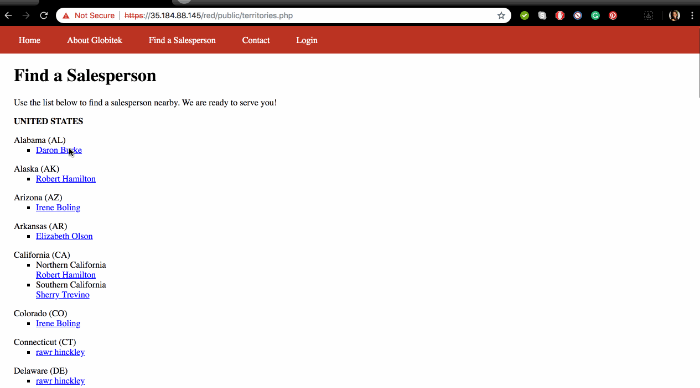
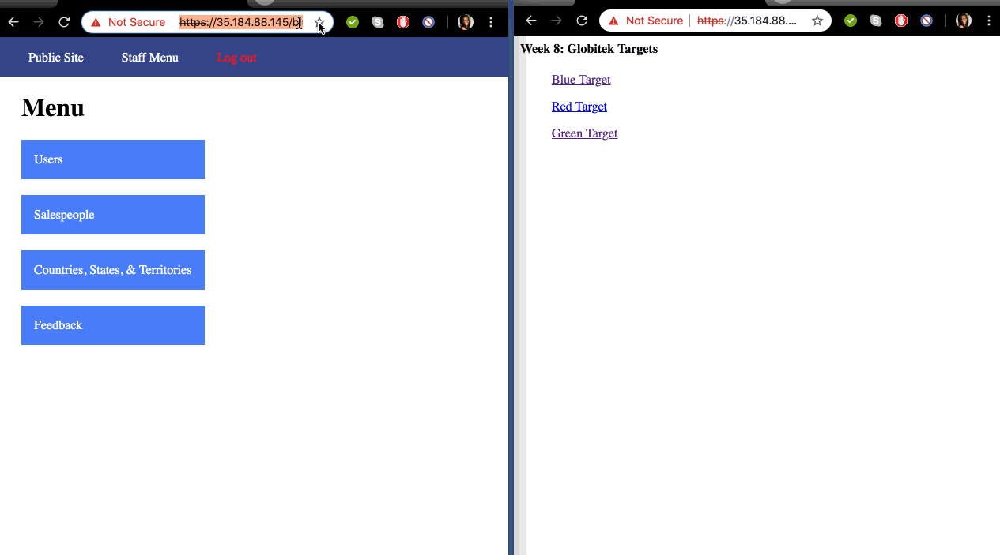
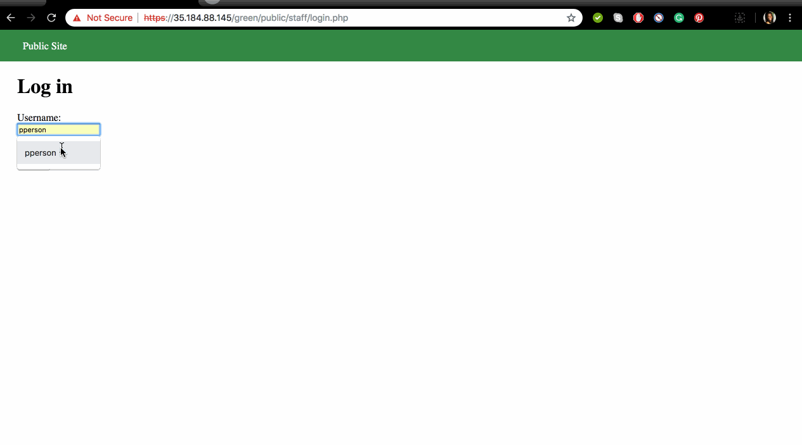
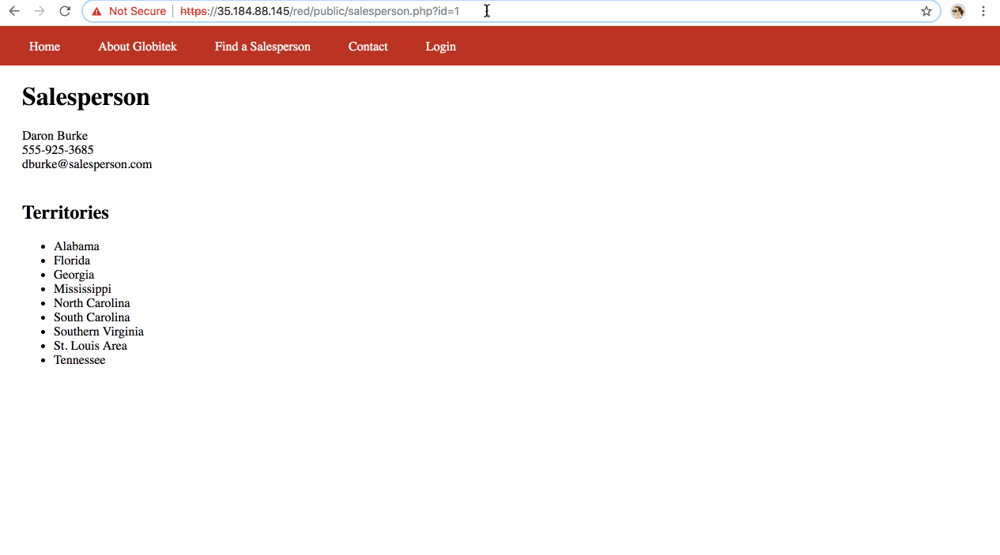
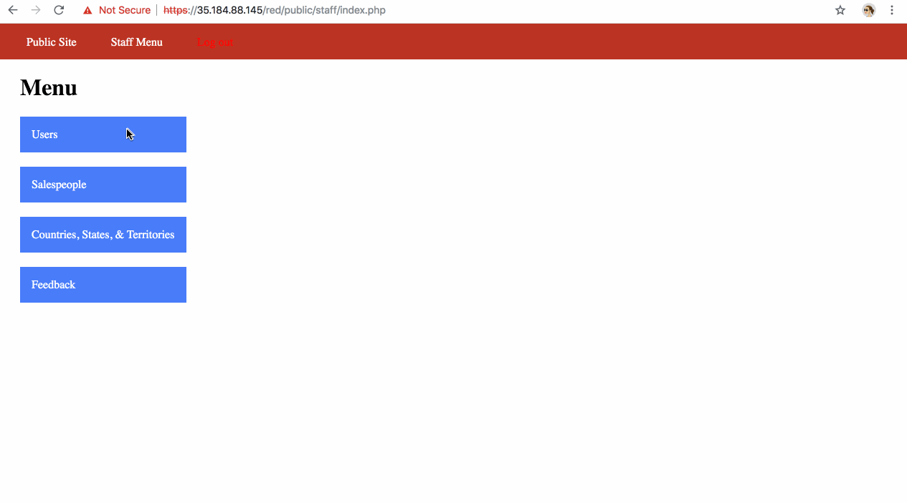

## week8-Cybersecurity
Dekuwin E. I. Kogda

# Project 8 - Pentesting Live Targets

Time spent: **7** hours spent in total

> Objective: Identify which two vulnerabilities the blue target has, which two vulnerabilities the green target has, and which two vulnerabilities the red target has

# Pentesting Report
BLEU Targets
1.  SQL Injection (SQLi)
  -[]Summary: We get no error on both red and green but we an error on the blue
  -
  
2. Session Hijacking/Fixation
  -[]Summary: We login on one browser and also on another one at the same time, which the user information can be stolen
  -

GREEN Targets
3. Username Enumeration
  - [ ] Summary: 
      -When Username is correct and the password is incorrect we get error with value="faillure" as result
      -When Username is correct and the password is blanck we get a message "Password cannot be blank"
  -

4. Cross-Site Scripting:
  - [ ] Summary: 
    - When we read our feedback after filling up the contact setion, it get captures the name we enter and displays our name and email
   -
5. Insecure Direct Object Reference 
   -
 1.Cross-Site Request Forgery
  -

## Notes

Describe any challenges encountered while doing the work

## License

    Copyright [yyyy] [name of copyright owner]

    Licensed under the Apache License, Version 2.0 (the "License");
    you may not use this file except in compliance with the License.
    You may obtain a copy of the License at

        http://www.apache.org/licenses/LICENSE-2.0

    Unless required by applicable law or agreed to in writing, software
    distributed under the License is distributed on an "AS IS" BASIS,
    WITHOUT WARRANTIES OR CONDITIONS OF ANY KIND, either express or implied.
    See the License for the specific language governing permissions and
    limitations under the License.
